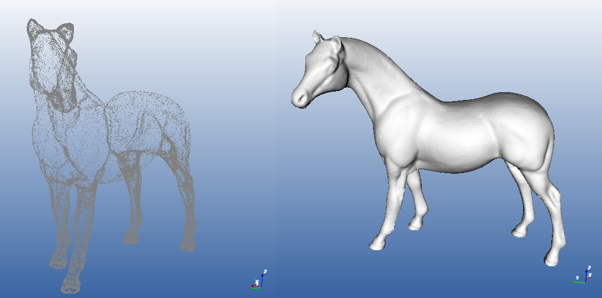

# Poisson Surface Reconstruction Python Binding 

Poisson Surface Reconstruction v6.13 

Python Binding of Poisson Reconstruction by  [Michael Kazhdan] (http://www.cs.jhu.edu/~misha/Code/PoissonRecon/Version6.13/)
for C++ GNU Compilation [PoissonRecon_v6_13](https://github.com/mmolero/PoissonRecon_v6_13) based on the MATLAB MEX-File bindings by [Daeyun Shin](https://github.com/daeyun/poisson-surface-reconstruction)


---

## Installation 

```bash
$ git clone --recursive git://github.com/mmolero/pypoisson.git
$ cd pypoisson
$ python setup.py build
$ python setup.py install
```
tested on Windows, OSX & Linux


## Go to the example folder
    

```python
from pypoisson import poisson_reconstruction
from ply_from_array import points_normals_from, ply_from_array

filename = "horse_with_normals.xyz"
output_file = "horse_reconstruction.ply"

#Helper Function to read the xyz-normals point cloud file
points, normals = points_normals_from(filename)

faces, vertices = poisson_reconstruction(points, normals, depth=10)

#Helper function to save mesh to PLY Format
ply_from_array(vertices, faces, output_file=output_file)
 
```




## Development

This python binding is still in progress, any feedback is welcome


